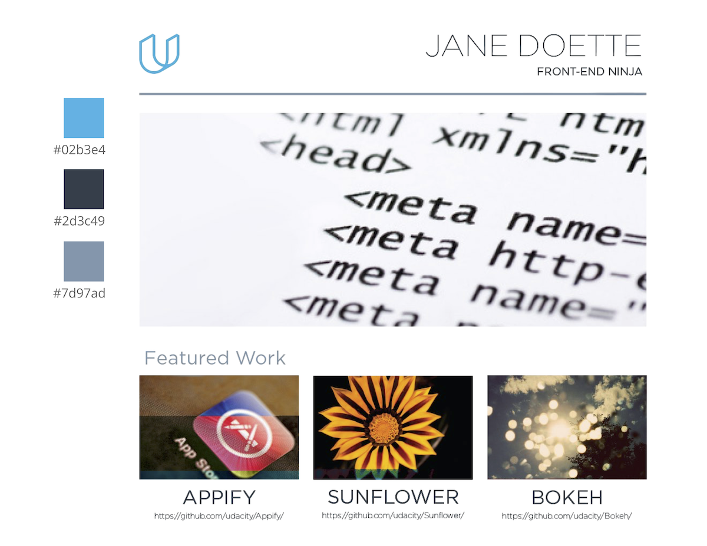

# Porfolio Site

This is the second project of the [Full Stack Web Developer Nanodegree](https://in.udacity.com/course/full-stack-web-developer-nanodegree--nd004/?). 

A mockup is provided based on which a responsive portfolio website is to be built from scratch. 

## How do I run this?

To view the website, open `index.html` using a browser.

## Project Rubric

|SECTION|SUB-SECTION|CRITERIA|SPECS. MET?|
|---|---|---|---|
| Design | Required Elements |The page at minimum includes at least <li>4 images, <li>title text (h1, h2, etc.), <li>regular (paragraph) text and <li>a logo.|Yes|
| | Semantic HTML |HTML5 semantic tags such as `<header>`, `<footer>`, `<article>`, `<section>` etc. are used to add meaning to the code.  No `
` or `<section>` tags are without a CSS class or id.  Check out the W3C documentation on [HTML Structural Elements](https://www.w3.org/wiki/HTML_structural_elements).|Yes|
| | Custom Design | Provide at least one of the following customizations: <li>Customize images and text <li> Customize placement of the elements on the page (grid layout) with HTML, CSS or both. <li> Customize CSS styles applied at minimum to paragraph and heading elements. |Yes|
| | Grid-Based Layout | Page utilizes a grid-based layout with styles making use of the `flexbox` layout or a framework like `Bootstrap`, `Foundation`, etc.  If you're using Bootstrap or standard HTML/CSS: the rows and columns of the grid must be wrapped in an element with a container class. |Yes, `flexbox` used|
|Responsiveness| Cross-Device Compatibility | All content is responsive and displays on all display sizes. This includes: <li> Desktop <li> Mobile: Google Nexus 5 <li> Tablet: Apple iPad   An image's associated title and text renders next to the image in all viewport sizes.   TIP: Test responsiveness with Chrome Developer Tools device emulation by right-clicking anywhere on page, selecting ‘Inspect Element’, clicking the rectangle to the left of the Elements tab, select Apple iPad or Google Nexus 5 from Device drop-down list, and click reload. |Yes|
| | Provide All Content | All content is rendered on all three devices. No content should be hidden on mobile devices. |Yes|
| | Viewport meta Tag | Viewport `meta` tag is included in `HTML`. (i.e. `<meta name=”viewport”`) |Yes|
| | Responsive Images | If a CSS framework is used, classes provided by the CSS framework are used to make images responsive, otherwise media-queries are used to ensure responsiveness of images. |Yes, media queries used|
|Separation of Concerns| Styles Separated From HTML | Portfolio completely separates structure (HTML) from design/style (CSS). There are no style attributes present in the body of the HTML document. There are no `<style>` elements in the document.  Note: It is acceptable to include height and width attributes in  elements. |Yes|
| | File structure | Files are organized with a directory structure that separates files based on functionality. For example: <li>`css/` for stylesheets<li>`img/` for images<li>`js/` for JavaScript files |Yes|
|Code Quality|HTML Formatting rules| <li>All code ( `HTML` element names, attributes, attribute values) is lowercase (except `text/CDATA`).<li>Code does not have trailing white spaces.<li>Indentation is consistent (either all tabs or all 2 spaces or all 4 spaces etc).<li>Code uses a new line for every block, list or table element and indent every such child element (it's acceptable to put all `<li>` elements in one line).<li>[Optional] When quoting attribute values, code uses double quotation marks. |Yes|
||HTML Style Rules|<li>HTML documents use HTML5 `<!doctype html>`. <li>Code passes HTML and CSS validators.<li>[Optional] Code does not use entity references unless necessary e.g. characters with special meaning in HTML (like < and &) as well as control or “invisible” characters (like no-break spaces).<li> [Optional] Code omits type attributes for style sheets and scripts. |Yes, but chose to ignore warning ['Section lacks headers'](https://www.w3.org/wiki/HTML/Usage/Headings/Missing)|
| | CSS Formatting Rules | <li>Code does not have trailing white spaces.<li>Indentation is consistent (either all tabs or all 2 spaces or all 4 spaces etc).<li>Code indents all block content, that is rules within rules as well as declarations to reflect hierarchy and improve understanding.<li>Code uses a semicolon after every declaration for consistency and extensibility reasons.<li>Code always uses a space after a property name's colon, but no space between property and colon, for consistency reasons.<li>Code always use a single space between the last selector and the opening brace that begins the declaration block.<li>Code always start a new line for each selector and declaration.<li>Code always put a blank line (two line breaks) between rules.<li>[Optional] Code uses double quotation marks for attribute selectors or property values. Do not use quotation marks in `URI` values (`url()`). | Yes|
| | CSS Style Rules | <li>Code uses meaningful or generic ID and class names that are as short as possible but as long as necessary.<li>Code does not use element names in conjunction with IDs or classes.<li>Code uses shorthand properties where possible.<li>[Optional] Code omits unit specification after 0 values.<li>[Optional] Code includes leading 0s in decimal values for readability.<li>[Optional] Code uses 3-character hexadecimal notation where possible.<li>[Optional] Code separate words in ID and class names by a hyphen.<li>[Optional] Code avoids user agent detection as well as `CSS` "hacks"—try a different approach first. |Yes|
| | General Meta Rules | HTML templates and documents use UTF-8 encoding. (no BOM) i.e. `<meta charset="utf-8">`. *[Optional] Mark todos and action items with `TODO` | Yes|

## Mock Provided

## Attributions

The photos used are licensed under [Creative Commons Zero (CC0)](https://www.pexels.com/photo-license/), taken from [Pexels.com](https://www.pexels.com).

