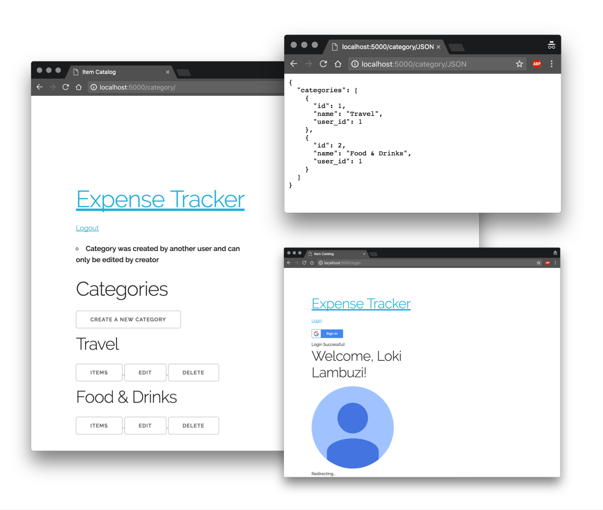

# Item Catalog

This is the fourth project of the [Full Stack Web Developer Nanodegree](https://in.udacity.com/course/full-stack-web-developer-nanodegree--nd004/?). 

The objective of the Item Catalog is to build a website with Flask, SQLAlchemy, third party OAuths and API endpoints.



## How do I run this?

### 1. Setup: Configure VM & Database

**Step 1:** Download and install [Vagrant](https://www.vagrantup.com/) and [VirtualBox](https://www.virtualbox.org). We’ll need these tools to setup and manage the Virtual Machine (VM). 

I used version 1.9.2 of Vagrant and version 5.1 of VirtualBox (mentioned because I faced issues on newer and older versions). 

**Step 2:** Once you've cloned this project, open the terminal and then run the following commands:

```
# Install & Configure VM
cd /path/to/vagrant
vagrant up

# Log into machine
vagrant ssh

# Log out of machine
# <Ctrl + D>

# Destroy machine once done
vagrant destroy

```

Note: If this is the first time you're running [Vagrant Up](https://www.vagrantup.com/docs/cli/up.html) command, you need to wait a while after running the command. 


### 2. Run the website

Open the terminal. Then, run the following commands:

```
# Launch & Login to machine
cd /path/to/vagrant
vagrant up
vagrant ssh

# Open shared folder
cd /vagrant/catalog 

# Run the program
python catalog.py
```

## Project Rubric

|SECTION|SUB-SECTION|CRITERIA|SPECS. MET?|
|---|---|---|---|
| API Endpoints |  | The project implements a JSON endpoint that serves the same information as displayed in the HTML endpoints for an arbitrary item in the catalog.|Yes|
| CRUD | Read | Does the website read category and item information from a database?|Yes|
| | Create | Does the website include a form allowing users to add new items and correctly processes these forms? |Yes|
| | Update | Does the website include a form to update a record in the database and correctly processes this form? |Yes|
| | Delete | Does the website include a way to delete an item from the catalog? | Yes |
| Authentication & Authorization | Consider Authorization Status prior to Execution | Create, delete and update operations do consider authorization status prior to execution. | Yes |
| | Implement third party authenthication and authorization service | Page implements a third-party authentication & authorization service (like `Google Accounts` or `Mozilla Persona`) instead of implementing its own authentication & authorization spec. | Yes |
| | Show Login and Logout button | Make sure there is a 'Login' and 'Logout' button/link in the project. The aesthetics of this button/link is up to the discretion of the student. | Yes |
| Code Quality | | Code is ready for personal review and neatly formatted and compliant with the Python [PEP 8](https://www.python.org/dev/peps/pep-0008/) style guide. | Yes |
| Comments | | Are comments present and effectively explain longer code procedures? | Yes |


