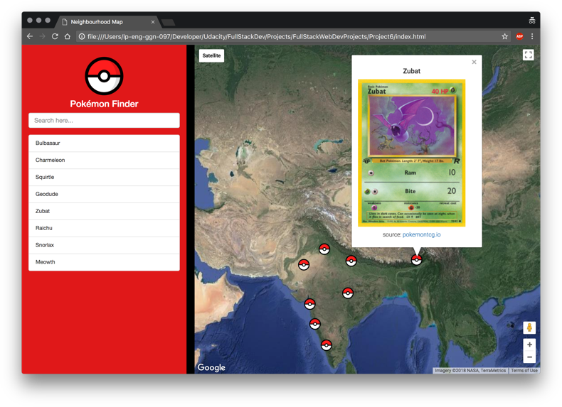

# Neighbourhood Map

This is the fifth project of the [Full Stack Web Developer Nanodegree](https://in.udacity.com/course/full-stack-web-developer-nanodegree--nd004/?). 

The objective is to develop a single page application featuring a map of your neighborhood.

## How do I run this?

Once you've downloaded this project, open `index.html`. 

## Project Rubric

|SECTION||CRITERIA|SPECS. MET?|
|---|---|---|---|
| Interface Design | Responsiveness | All application components render on-screen in a responsive manner.|Yes|
| | Usability | All application components are usable across modern desktop, tablet, and phone browsers.|Yes|
| App Functionality | Filter Locations | Includes a text input field or dropdown menu that filters the map markers and list items to locations matching the text input or selection. Filter function runs error-free. |Yes|
| | List View | A list-view of location names is provided which displays all locations by default, and displays the filtered subset of locations when a filter is applied.  Clicking a location on the list displays unique information about the location, and animates its associated map marker (e.g. bouncing, color change.)  List functionality is responsive and runs error free. |Yes|
| | Map and Markers | Map displays all location markers by default, and displays the filtered subset of location markers when a filter is applied.  Clicking a marker displays unique information about a location in either an infoWindow or DOM element.  Markers should animate when clicked (e.g. bouncing, color change.)  Any additional custom functionality provided in the app functions error-free. |Yes|
| App Architecture | Proper Use of `Knockout` | Code is properly separated based upon `Knockout` best practices (follow an `MVVM`pattern, avoid updating the `DOM` manually with `jQuery` or `JS`, use `observables` rather than forcing refreshes manually, etc). Knockout should not be used to handle the `Google Map API`.  There are at least 5 locations in the model. These may be hard-coded or retrieved from a data API.|Yes|
| Asynchronous Data Usage | Asynchronous API Requests | Application utilizes the Google Maps API and at least one non-Google third-party API. Refer to this [documentation](https://developers.google.com/maps/documentation/javascript/tutorial).  All data requests are retrieved in an asynchronous manner.|Yes|
| | Error Handling | Data requests that fail are handled gracefully using common fallback techniques (i.e. `AJAX` error or fail methods). 'Gracefully' means the user isn’t left wondering why a component isn’t working. If an `API` doesn’t load there should be some visible indication on the page (an alert box is ok) that it didn’t load. Note: You do not need to handle cases where the user goes offline. |Yes|
| Location Details Functionality | Additional Location Data | Functionality providing additional data about a location is provided and sourced from a 3rd party API. Information can be provided either in the marker’s infoWindow, or in an HTML element in the DOM (a sidebar, the list view, etc.)  Provide attribution for the source of additional data. For example, if using Foursquare, indicate somewhere in your UI and in your README that you are using Foursquare data.|Yes|
| | Error Free | Application runs without errors.|Yes|
| | Usability | Functionality is presented in a usable and responsive manner.|Yes|
| Documentation | Read | Does the website read category and item information from a database?|Yes|
| | README | A `README` file is included detailing all steps required to successfully run the application. |Yes|
| | Comments | Comments are present and effectively explain longer code procedures. |Yes|
| | Code Quality | Code is formatted with consistent, logical, and easy-to-read formatting as described in the [Udacity JavaScript Style Guide](http://udacity.github.io/frontend-nanodegree-styleguide/javascript.html).  If build tools (such as Gulp or Grunt) are used, both source and production code are submitted in the same repository in separate directories. These directories are usually named src and dist respectively.|Yes|

## Credits

I've used the following in my project:

- [Pokemon TCG Developer API](https://pokemontcg.io)
- [Pokeball Image](https://commons.wikimedia.org/wiki/File:Pok%C3%A9_Ball_icon.svg)

