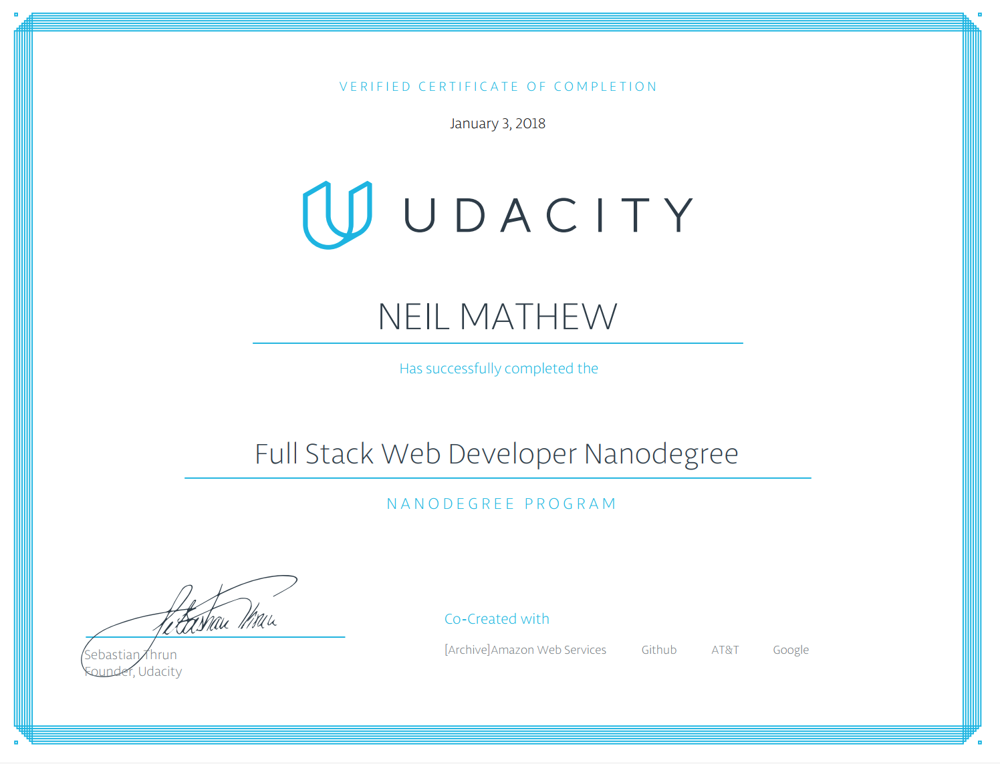

## Introduction 

This repository contains all the projects done as part of the [Full Stack Web Developer Nanodegree](https://in.udacity.com/course/full-stack-web-developer-nanodegree--nd004/?). 

## Projects

1. [Movie Trailer Website](Project1/)
2. [Build a Portfolio Site](Project2/)
3. [Logs Analysis](Project3/)
4. [Item Catalog](Project4/)
5. [Neighborhood Map](Project5/)
6. [Linux Server Configuration](Project6/)

## Certificate

[confirm.udacity.com/FPNZCKPZ](https://confirm.udacity.com/FPNZCKPZ)

## License

Meh. Do what you will. These projects are using [The Unlicense License](https://choosealicense.com/licenses/unlicense/). 
